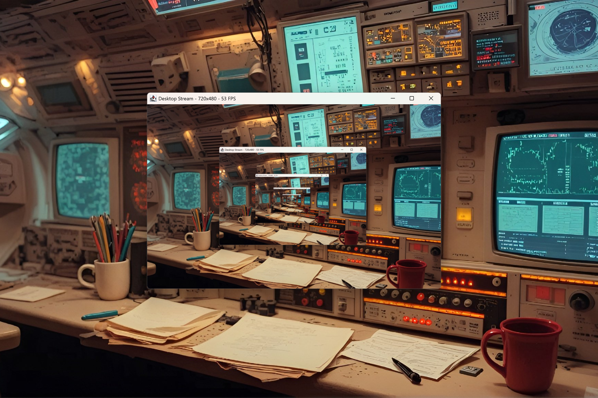

# FastRobot 0.1.0 [ALPHA-2026-06-14] — High-FPS Screen Capture & Native Automation for Java

[](https://github.com/andrestubbe/FastRobot/releases/tag/0.1.0)
[](https://opensource.org/licenses/MIT)
[](https://www.java.com)
[]()
[](https://jitpack.io/#andrestubbe/FastRobot)

**🤖 The high-performance alternative to `java.awt.Robot` — 10–17× faster screen capture and 5–15× faster input events using DirectX and GDI.**

FastRobot is built for developers who need raw speed. Whether it's high-FPS screen streaming, low-latency bot input,
or computer vision at 60+ FPS, FastRobot delivers where the standard AWT Robot fails.

[](https://www.youtube.com/watch?v=BZsqQl7WqWk)

---

## Table of Contents

- [Features](#features)
- [Quick Start](#quick-start)
- [Installation](#installation)
- [Documentation](#documentation)
- [Platform Support](#platform-support)
- [License](#license)
- [Related Projects](#related-projects)

---

## Features

- ⚡ **Ultra-Fast Capture** — 10–17× faster than `java.awt.Robot` using DirectX DXGI Desktop Duplication.
- 🖱️ **Zero-Latency Input** — Native mouse and keyboard injection via DirectInput/SendInput.
- 🖥️ **Desktop Duplication** — 60+ FPS real-time desktop streaming with hardware GPU path.
- 🚀 **Zero GC Stalls** — Native memory buffers keep your Java heap completely clean.

---

## Quick Start

```bash
# Clone the repository
git clone https://github.com/andrestubbe/FastRobot.git

# Build the native bridge
cd FastRobot
.\compile.bat

# Launch the demo
.\run-demo.bat
```

---

## Installation

### Option 1: Maven (Recommended)

Add the JitPack repository and the dependencies to your `pom.xml`:

```xml
<repositories>
    <repository>
        <id>jitpack.io</id>
        <url>https://jitpack.io</url>
    </repository>
</repositories>

<dependencies>
    <!-- FastRobot Library -->
    <dependency>
        <groupId>com.github.andrestubbe</groupId>
        <artifactId>FastRobot</artifactId>
        <version>0.1.0</version>
    </dependency>

    <!-- FastCore (Required Native Loader) -->
    <dependency>
        <groupId>com.github.andrestubbe</groupId>
        <artifactId>FastCore</artifactId>
        <version>0.1.0</version>
    </dependency>
</dependencies>
```

### Option 2: Gradle (via JitPack)

```groovy
repositories {
    maven { url 'https://jitpack.io' }
}

dependencies {
    implementation 'com.github.andrestubbe:FastRobot:0.1.0'
    implementation 'com.github.andrestubbe:FastCore:0.1.0'
}
```

### Option 3: Direct Download (No Build Tool)

Download the latest JARs directly to add them to your classpath:

1. 📦 **[fastrobot-0.1.0.jar](https://github.com/andrestubbe/FastRobot/releases/download/0.1.0/fastrobot-0.1.0.jar)** (The Core Library)
2. ⚙️ **[fastcore-0.1.0.jar](https://github.com/andrestubbe/FastCore/releases/download/0.1.0/fastcore-0.1.0.jar)** (The Mandatory Native Loader)

> [!IMPORTANT]
> All JARs must be in your classpath for the native JNI calls to function correctly.

---

## Documentation

* **[COMPILE.md](docs/COMPILE.md)**: Full compilation guide (MSVC C++17 build chain + JNI Setup).
* **[REFERENCE.md](docs/REFERENCE.md)**: Full API descriptions and method reference.
* **[PHILOSOPHY.md](docs/PHILOSOPHY.md)**: The engineering rationale for zero-allocation performance.
* **[ROADMAP.md](docs/ROADMAP.md)**: Future milestones and planned features.

---

## Platform Support

| Platform      | Status             |
|---------------|--------------------|
| Windows 10/11 | ✅ Fully Supported  |
| Linux         | 🚧 Planned         |
| macOS         | 🚧 Planned         |

---

## License

MIT License — See [LICENSE](LICENSE) file for details.

---

## Related Projects

- [FastCore](https://github.com/andrestubbe/FastCore) — Native Library Loader for Java
- [FastScreen](https://github.com/andrestubbe/FastScreen) — High-Performance Native Screen Capture for Java
- [FastMouse](https://github.com/andrestubbe/FastMouse) — Native Mouse API for Java
- [FastKeyboard](https://github.com/andrestubbe/FastKeyboard) — Native Windows RawInput API for Java
- [FastOCR](https://github.com/andrestubbe/FastOCR) — Ultra-Fast Native OCR for Java
- [FastImage](https://github.com/andrestubbe/FastImage) — Ultra-Fast Native Image Processing for Java

---
**Part of the FastJava Ecosystem** — *Making the JVM faster. ⚡*
